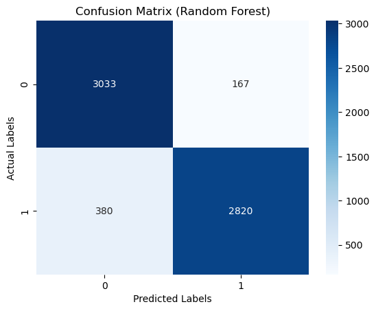
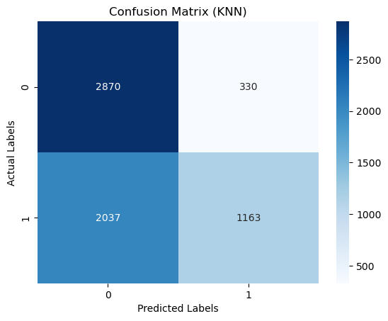
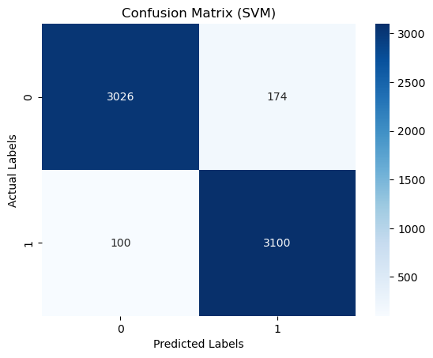
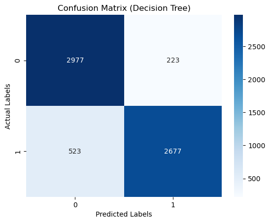
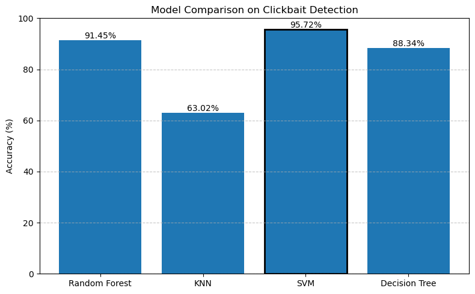

<h1>Clickbait Detection from Headlies</h1>

This repo contains ML algorithms used to detect clickbaits from different headlines in English and Bengali Language.

<h1>Confusion Matrices (English Dataset)</h1>

<h1>Barchart of the accuracies of these 4 models:</h1>

